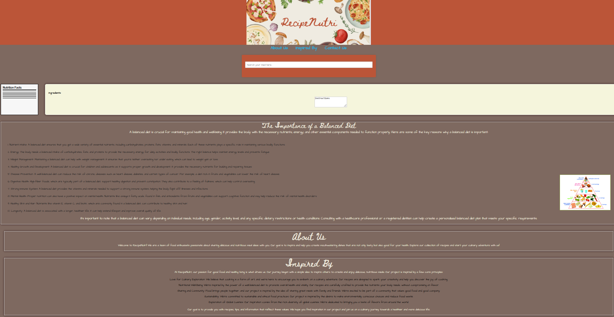

# Recipe-Nutri

## Table of Contents
-Description
-Features
-Usage
-Technologies
-Screenshot
-Link

## Description
RecipeNutri is a web application that allows users to find and explore recipes while providing detailed nutritional information. Users can search for recipes by recipe name, view cooking instructions, and get accurate nutrition facts for their chosen dishes. This README provides an overview of the application, instructions for usage, and details for developers.

## Features
Recipe Search: Search for recipes by entering dish names.
Recipe Details: View detailed information for each recipe, including ingredients, preparation steps, and total cooking time.
Nutritional Information: Get precise nutritional information for each recipe, including calories, nutrients, and more.

## Usage
RecipeNutri is designed for effortless recipe searching and nutrition data retrieval. Follow these steps to effectively use the application:
**Search for Recipes**:
On the homepage, enter the dish name into the search bar.
Click enter to retrieve the recipe.
**View Recipe Details**:
Click on a recipe from the search results to view detailed information, including ingredients and cooking instructions.
**Get Nutritional Information**:
After selecting a recipe, the page will automatically retrieve precise nutritional facts for the recipe on the far left in the nutrition facts area, including calories, protein, carbohydrates, and more.

## Technologies 
-HTML
-CSS
-Skeleton
-Javascript
-API's-(https://themealdb.com/) and (https://fdc.nal.usda.gov/api-guide.html)

**USDA API Reference**
Title of the API: Food Data Central
Author or Organization: U.S. Department of Agriculture (USDA)
URL: https://api.nal.usda.gov/fdc/v1/foods/search
Access Date: [10/24/2023]

**The MealDB API Reference**
Title of the API: The Meal DB
Author or Organization: TheMealDB
URL: https://www.themealdb.com/api/json/v1/1/search.php?s=
Access Date: [10/24/2023]

## Screenshot

## Link
https://github.com/natemcmahon/Recipe-Nutri.git
